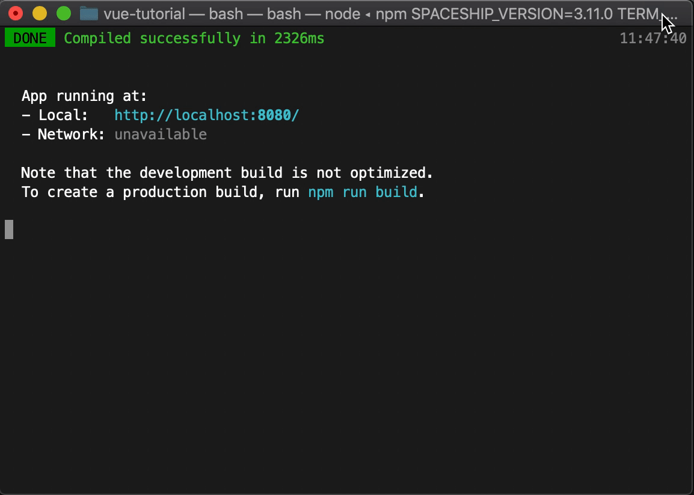
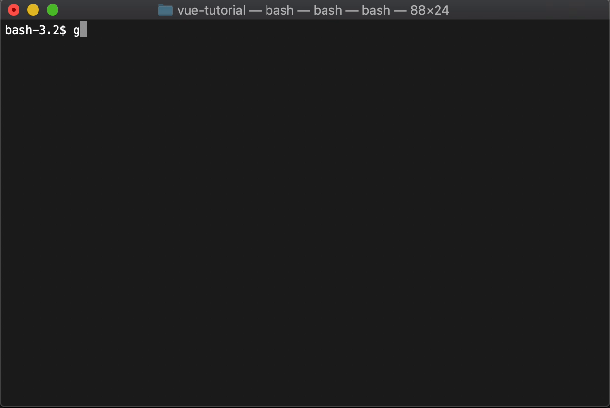
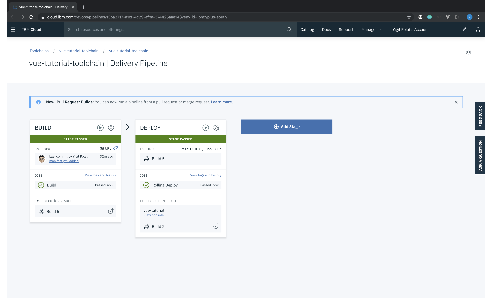

# Introduction

JavaScript is one of the most widely used programming languages in web development. Numerous frameworks and libraries are available to speed up and simplify the development process. [Vue.js](https://vuejs.org/) is the rising star of front-end frameworks already used by leading tech compnaies like GitLab, Adobe, and Alibaba that build single-page applications and progressive web applications.

# Learning objectives

In this tutorial, I cover concepts such as creating, building, and deploying Vue.js projects. You will learn how to:

* Create a Vue.js project using the Vue CLI
* Create a Toolchain on IBM Cloud
* Deploy static web applications to Cloud Foundry

# Prerequisites

This tutorial assumes you understand the fundamentals of Vue.js development. To complete the steps in this tutorials, you need to:

* Create a free [IBM Cloud account](https://cloud.ibm.com/)
* Install [Node.js](https://nodejs.org/en/download/) on your system
* Install [Vue CLI](https://cli.vuejs.org/guide/installation.html) on your system
* Install [Git](https://git-scm.com/downloads) on your system
* Create a [GitHub account](https://github.com/)

# Featured technologies

* [IBM Cloud](https://cloud.ibm.com) is a suite of cloud computing services from IBM that offers both platform as a service (PaaS) and infrastructure as a service (IaaS).
* [Node.js](https://nodejs.org/en/) is an open source, cross-platform runtime environment for developing server-side and networking applications.
* [Vue CLI](https://cli.vuejs.org) is a globally installed npm package and provides the Vue command in your terminal.
* [Git](https://git-scm.com) is a free, open source distributed version control system designed to handle projects quickly and efficiently.
* [GitHub](https://github.com) is a distributed version-control platform where users collaborate on or adopt open source code projects.
* [Cloud Foundry](https://www.ibm.com/cloud/cloud-foundry) is an open source, platform-as-a-service (PaaS) on IBM Cloud that enables you to deploy and scale apps without managing servers.

# Step 1. Create a Vue project

1. Make sure the Vue CLI is installed correctly by running:

    ```bash
    $ vue --version
    ```

2. Navigate to the directory where you want to store your project and create a new Vue project via your command prompt.

    ```bash
    $ vue create vue-tutorial
    ```

    > Note: You can either select features by default with [Babel](https://babeljs.io/) and [ESLint](https://eslint.org/) or manually with more configurations such as Router, Linter, Vuex, and the like.

3. After your project is created, you can run the project with the following commands:

    ```bash
    $ cd vue-tutorial
    $ npm run serve
    ```

    <p align="center"></p>

4. Open your favorite browser and navigate to the URL where the app is running; in this case it's running at http://localhost:8080.

    <p align="center"></p>

# Step 2. Commit your changes

Now that you've genereted a boilerplate application (otherwise known as a template or skeleton application), it's time to make changes to the application to personalize it with your project's requirements. 

Depending on the size of the project, application development can take a long time. You need a version control system tool to keep track of the project, see what changes you've made (and why), undo features, and the like. This tutorial uses two versional control systems &mdash; Git and GitHub. If you need a refresher on these tools, read the [Learn the workings of Git, not just the commands](https://developer.ibm.com/tutorials/d-learn-workings-git/) tutorial.

Vue CLI initilizes a Git repository inside a project and makes the first commit by default.

1. Let's make a small modification in the main page and make our second commit. For that, open the project with your preferred code editor and find the file under the /src/App.vue folder. Change the line number 4 as `<HelloWorld msg="Welcome to Your Vue.js App"/>` .

    > Note: If you did not stop the serving process on the terminal, you can see the changes instantly. If you already stopped the process, run `npm run serve` again in the project directory.

    <p align="center"></p>

2. Return back to your existing CLI and stop your development environment with `Ctrl + C` or open a new CLI window and change the directory to your project.

    ```bash
    $ git add .
    $ git commit -m "my commit"
    ```

    <p align="center"></p>

Git runs locally on a computer, but GitHub might be a better choice because you can host your repositories in a remote server and protect them from local crashes. We will create a remote repository and push our local commits to GitHub servers.

3. Now it's time to create a new repository on GitHub and add the URL for the remote repository where your local repository will be pushed. To do that, go to your GitHub account on your browser and create a new repository, name it, and give it a  description.

    <p align="center"></p>
    
4. Finally, you need to push the changes in your local repository up to the remote repository that you specified as the origin. You can either copy and paste the commands GitHub gives you right after you create the repository or use the commands below, inserting your repository URL.

    ```bash
    $ git remote add origin <your_remote_repository_url>
    $ git push -u origin master
    ```

    <p align="center"></p>

# Step 3. Deploy your project to IBM Cloud

Using DevOps practices enables you to adjust quickly to changing requirements and still ensure stable application deployments. This tutorial follows DevOps strategies to deploy your Vue project to IBM Cloud.

[Toolchains](https://cloud.ibm.com/docs/services/ContinuousDelivery?topic=ContinuousDelivery-toolchains_about) in IBM Cloud are a set of tool integrations that support development, deployment, and operations tasks. There are a large number of toolchain templates depending on your intention. For this tutorial, select the one for Cloud Foundry. [Delivery Pipeline](https://cloud.ibm.com/docs/services/ContinuousDelivery?topic=ContinuousDelivery-deliverypipeline_about) is an essential component of any toolchains where the Build, Test, Release, and Deploy steps of continuous integration and continious deployment are handled.

1. Log in to [IBM Cloud](https://cloud.ibm.com/) with your credentials and find the Toolchain service under the **Developer Tools** section in the **Catalog**. After selecting Toolchain service, you will see numerous toolchain templates. 

1. Select **Developer a Cloud Foundry App** from the list of templates. 
1. Name your Toolchain service.
1. Complete the tool integration steps by doing the following:
    1. Select *GitHub* as the source provider.
    1. Authorize IBM Cloud Toolchains to work with GitHub.
    1. Set your repository type as *Existing*.
    1. Specify your repository URL; this is the GitHub repository you created in previous steps.
    1. Create and IBM Cloud API Key for Delivery Pipeline, respectively. 
    1. Click **Create** to complete this step.

    <p align="center"></p>

    >Note: You should select the region, organization, and space correcly while creating Cloud Foundry applications. If you are not sure what values to use for these fields, go to **Manage > Account** and select **Account resources > Cloud Foundry orgs**.

    After completing the steps above, your toolchain should be created succesfully; however, it will fail when you try to deploy it becuase your configurations are incorrect. The following steps show you how to fix the configurations in your Delivery Pipeline, which has two separate stages &mdash; Build and Deploy.

    Thus far, you have used the `npm run serve` command to develop Vue projects on your local system. For production purposes, your code must be built. You can do this by running the `npm run build` command.

    Instead of building the source code every time in your development environment, you will set the toolchain to build the code in the Build phase.

1. To configure the Build stage, select the Delivery Pipeline component and click **Configure Stage** under the Build stage's gear button. Change the Builder type `simple` to `npm` and add `npm run build` under  the `npm install` command. Save this new configuration.
    
    <p align="center"></p>

    We are going to deploy our Vue.js application to Cloud Foundry which is as PaaS that ensures the fastest, easiest, and most reliable deployment of cloud-native applications. Cloud Foundry application specs are set in the file named *manifest.yml*. You can find more information about manifest.yml attributes in the [Cloud Foundry documentation](https://docs.cloudfoundry.org/devguide/deploy-apps/manifest-attributes.html).

1. You should create a *manifest.yml* file inside the main directory of your project where you set basic information about your application. After adding *manifest.yml* file to your workspace, commit and push the changes so that both your local and remote repositories notice the added file. Since changes in your GitHub repo trigger the pipeline where the Build and Deploy stages start doing their tasks in order, a new process will start automatically. If you are fast enough to switch your screen to your browser, you can see your pipeline already doing its job.

    ```yaml
    applications:
    - name: vue-tutorial
        path: ./dist
        buildpack: https://github.com/cloudfoundry/staticfile-buildpack.git
        random-route: true
        memory: 256M
        env:
        FORCE_HTTPS: true
    ```

    <p align="center"></p>


    This is what you expect to see when the CI/CD pipeline ends.

    <p align="center"></p>

# Step 4. Navigate to your project

Congratulations! You successfully deployed your front-end application to IBM Cloud! Now let's see how you can navigate to the URL via a browser.

In the IBM Cloud web console, search your Cloud Foundry application name via the search bar and select your application. You can either click on **Visit App URL** or navigate to the route listed in the Routes section at the top right corner of the screen.

<p align="center"></p>

Your toolchain has created a new Cloud Foundry application and assigned it with a random URL. Finally, you have your application running in the cloud and ready to share with your friends and colleagues!
